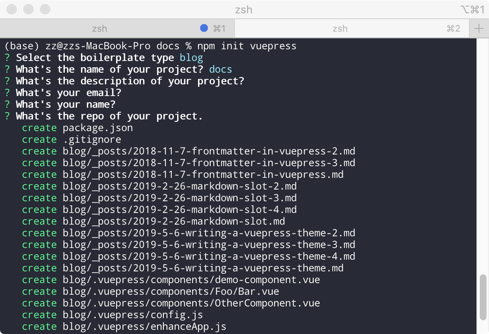
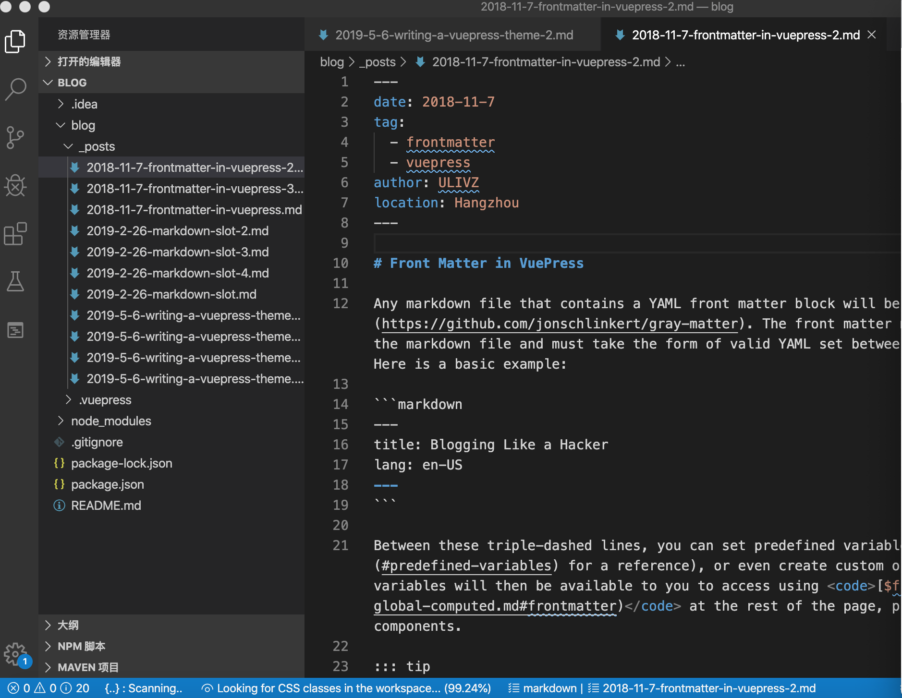

# vuepress 入门

## 生成vuepress模板
```bash
npm create vuepress
或者 npm init vuepress
```

npm create命令似乎是npm init 命令的别名，npm help create看到的也是npm init的文档，官网没有对npm create进行解释

## 选择模板完善信息
接下来选择默认模板和完善一些必须信息
- blog 是博客模板，个人博客用这个模板
- doc 是api文档模板，vue用的就是这个模板


`cd 你的项目` 进入你刚刚创建的项目  
`npm install` 下载依赖  
`npm run dev` 启动博客

默认serve在 `http://localhost:8080/`

vuepress blog项目打开是这样的  

/blog/_posts下的文件是vuepress默认的文章，教你如何使用vuepress，你的文章以后也放在这里
.vuepress 下的文件是vuepress的文件，可以自定义主题和样式

## 部署到github
1. 注册github [github](https://github.com/)
2. 新建一个repository，并将自己的项目上传到这个repository
3. 参照 [官方文档](https://vuepress.vuejs.org/zh/guide/deploy.html) 准备好`deploy.sh`
4. 去github配置ssh token
5. 终端输入 `sh deploy.sh` 即可把博客上传到github page
6. 打开`https://<USERNAME>.github.io/<REPO>`
